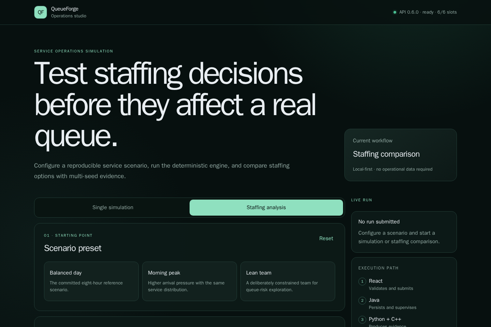
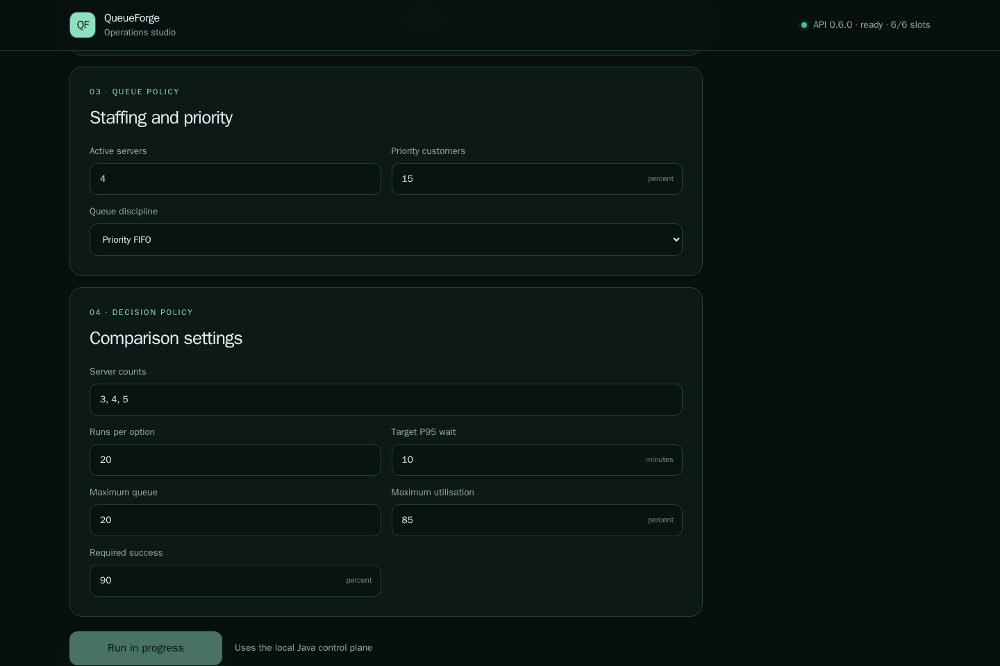
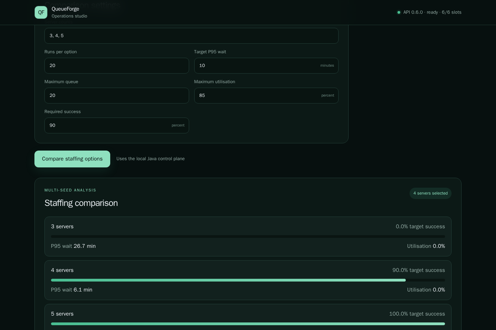
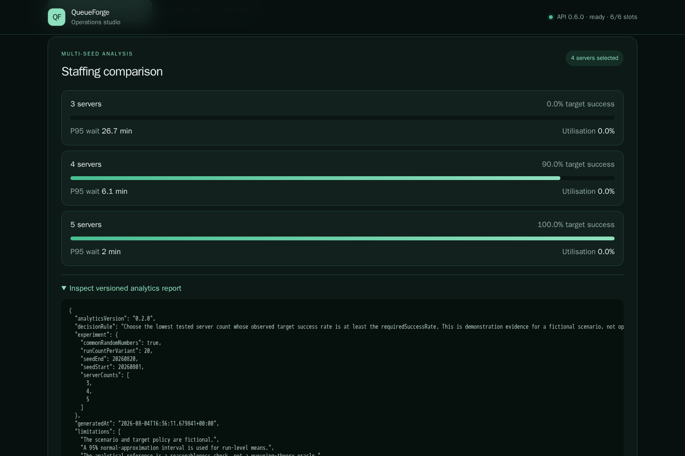
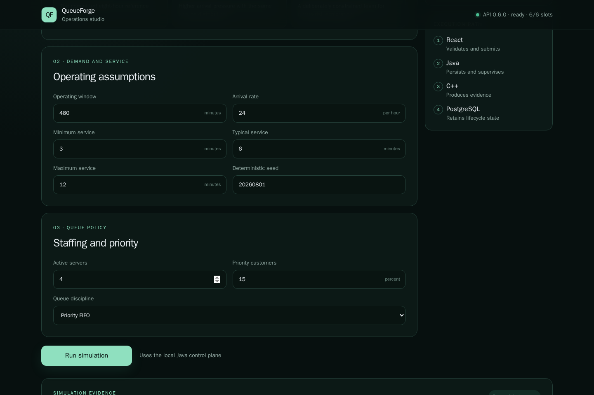
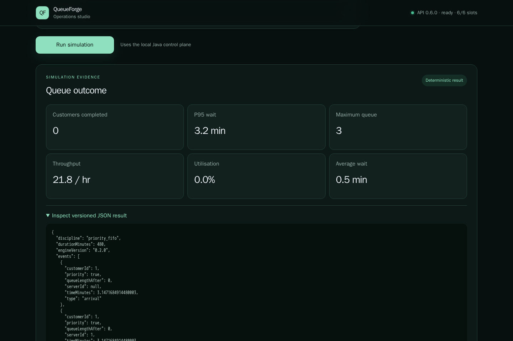
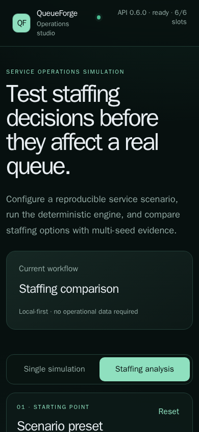

# QueueForge

QueueForge is a local-first service operations simulator for testing queue and
staffing decisions before they affect real operations. It combines a
deterministic C++20 simulation engine, Python multi-seed analytics, a Java
control plane, PostgreSQL persistence and a React interface.

## Product screenshots

<table>
<tr>
  <td width="50%"></td>
  <td width="50%"></td>
</tr>
<tr>
  <td><sub>Product overview and local stack status</sub></td>
  <td><sub>Scenario presets and operating assumptions</sub></td>
</tr>
<tr>
  <td width="50%"></td>
  <td width="50%"></td>
</tr>
<tr>
  <td><sub>Persisted live run lifecycle</sub></td>
  <td><sub>Multi-seed staffing comparison</sub></td>
</tr>
<tr>
  <td width="50%"></td>
  <td width="50%"></td>
</tr>
<tr>
  <td><sub>Versioned analytics JSON output</sub></td>
  <td><sub>Deterministic simulation KPI result</sub></td>
</tr>
<tr>
  <td width="50%"></td>
  <td width="50%"></td>
</tr>
<tr>
  <td><sub>Versioned simulation JSON output</sub></td>
  <td><sub>Responsive mobile interface</sub></td>
</tr>
</table>

## What the system proves

- versioned queue scenarios can be validated and reproduced
- fixed seeds produce deterministic C++ results
- Python can compare staffing options across repeated simulations
- Java persists and supervises worker execution
- PostgreSQL retains lifecycle and result data across restarts
- bounded admission returns explicit HTTP 429 responses under saturation
- worker failure, timeout, cancellation and control-plane restart are recoverable
- the React product interface uses the real API rather than mock data

## Architecture

| Component | Responsibility |
|---|---|
| React + TypeScript | Scenario configuration, run tracking and result review |
| Java + Spring Boot | Validation, bounded admission, lifecycle and process control |
| PostgreSQL + Flyway | Durable request, status, error and result persistence |
| Python | Multi-seed experiments, statistics and staffing recommendation |
| C++20 | Deterministic discrete-event queue simulation |
| Docker Compose | Reproducible local product and verification environment |
| GitHub Actions | Cross-language build, integration, reliability and performance gates |

## Reference verification

The values below were generated by `./VERIFY_PHASE_7.command` through the
normal Docker product stack. They are regression evidence from the recorded
environment, not production service-level objectives.

| Gate | Measured result |
|---|---:|
| C++ deterministic output | PASS |
| C++ p95 execution | 2.854 ms |
| Python staffing analysis | 0.541 s |
| API simulation success | 100% |
| API submit p95 | 81.461 ms |
| API end-to-end p95 | 202.235 ms |
| Production JavaScript | 207,947 bytes |
| Production CSS | 9,018 bytes |
| API image | 150,540,420 bytes |
| Web image | 21,891,795 bytes |

## Run locally

Requirements:

- Docker Desktop
- Git
- Python 3
- zsh on macOS/Linux

Start and verify the complete product:

```bash
./VERIFY_PHASE_8.command
```

Open:

```text
http://localhost:15176
```

The verification commands deliberately use Docker for C++, Java, Node,
PostgreSQL and browser evidence so the host machine does not require those
toolchains directly.

## Documentation

- [System architecture](docs/architecture/CONTROL_PLANE.md)
- [Reliability model](docs/architecture/RELIABILITY_MODEL.md)
- [Quality policy](docs/quality/QUALITY_POLICY.md)
- [Performance method](docs/performance/PERFORMANCE_METHOD.md)
- [Run lifecycle](docs/operations/RUN_LIFECYCLE.md)
- [Reliability playbook](docs/operations/RELIABILITY_PLAYBOOK.md)
- [Release summary](docs/release/PROJECT_SUMMARY.md)
- [v1.0.0 release notes](docs/release/RELEASE_NOTES_v1.0.0.md)
- [Final verification contract](docs/testing/PHASE_8_VERIFICATION.md)

## Delivery history

1. Product definition
2. Repository and local environment
3. C++ simulation engine
4. Python analytics
5. Java control plane
6. React product interface
7. Reliability and fault handling
8. Quality and performance
9. Release verification

All phases are complete in `v1.0.0`.

## Scope and limitations

QueueForge is a production-style local product. It does not claim distributed
worker coordination, cloud-scale capacity or operational staffing advice.
Performance values depend on the recorded host, Docker version and workload.

## License

MIT. See [LICENSE](LICENSE).
