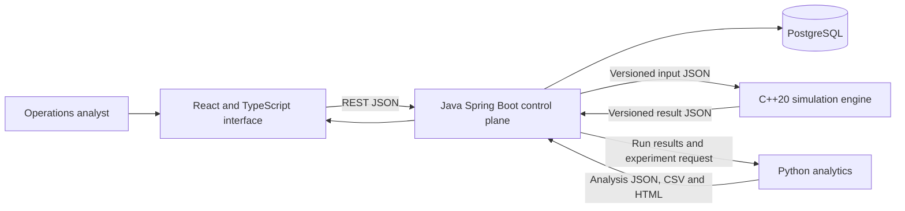

# System Context

## Boundary decisions

### Browser to control plane

The browser uses REST endpoints. Early phases use short polling for job state rather than WebSockets.

### Control plane to workers

The Java control plane starts short-lived local worker processes and exchanges versioned JSON files.

This design was selected because:

- each worker can be executed and tested independently
- failures have explicit exit codes and stderr
- no internal ports or service discovery are required
- the same command works locally and in CI
- run inputs and outputs remain inspectable evidence

### Persistence

PostgreSQL stores scenario metadata, immutable run snapshots, lifecycle state and result summaries. Larger generated artefacts remain in a controlled runtime directory and are referenced from the database.

## Trust boundaries

- Browser input is untrusted and validated by the Java API.
- Worker input is generated from validated, versioned objects.
- Worker output is untrusted until schema validation succeeds.
- File paths are generated by the control plane and are not accepted directly from browser input.
- Runtime files are separate from source-controlled evidence.
